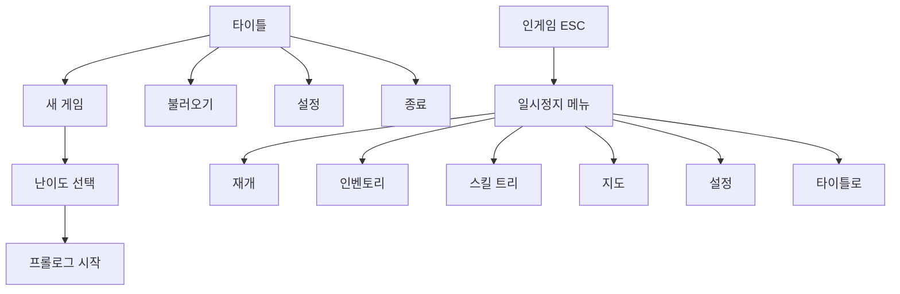

# UI/사운드 가이드 (UI & Sound Guide)

> 개발자용 UI 레이아웃 및 사운드 명세

---

## 1. HUD 레이아웃

### 1.1 화면 구성
```
┌─────────────────────────────────────────────────────────────────┐
│ [HP 바]░░░░░░░░░           [현재 위치]           [미니맵] │
│ [TP 바]░░░░░░░░░                                              │
│ [노화 게이지]░░░░                                              │
│                                                                 │
│                                                                 │
│                                                                 │
│                          [게임 화면]                            │
│                                                                 │
│                                                                 │
│                                                                 │
│ [퀵슬롯 1][2][3][4]                    [스킬] [크로노] [앵커]  │
│                                              [리와인드][에코]  │
└─────────────────────────────────────────────────────────────────┘
```

### 1.2 HP 바
| 요소 | 위치 | 크기 | 색상 | ID |
|------|------|------|------|-----|
| 배경 | 좌상단 (20, 20) | 200×20 | #1a1a1a | HUD_HP_BG |
| 채움 | 좌상단 (22, 22) | 196×16 | #e74c3c (빨강) | HUD_HP_FILL |
| 위험 (30% 이하) | - | - | #ff0000 (점멸) | HUD_HP_DANGER |
| 텍스트 | 바 우측 | - | #ffffff | HUD_HP_TEXT |

### 1.3 TP 바
| 요소 | 위치 | 크기 | 색상 | ID |
|------|------|------|------|-----|
| 배경 | 좌상단 (20, 45) | 200×15 | #1a1a1a | HUD_TP_BG |
| 채움 | 좌상단 (22, 47) | 196×11 | #3498db (파랑) | HUD_TP_FILL |
| 회복 중 | - | - | #5dade2 (밝은 파랑) | HUD_TP_REGEN |

### 1.4 노화 게이지
| 요소 | 위치 | 크기 | 색상 (단계별) | ID |
|------|------|------|---------------|-----|
| 배경 | 좌상단 (20, 65) | 150×10 | #1a1a1a | HUD_AGE_BG |
| 어린 (0-24%) | - | - | #2ecc71 (초록) | HUD_AGE_YOUNG |
| 청년 (25-49%) | - | - | #f1c40f (노랑) | HUD_AGE_ADULT |
| 중년 (50-74%) | - | - | #e67e22 (주황) | HUD_AGE_MIDDLE |
| 노인 (75-100%) | - | - | #9b59b6 (보라) | HUD_AGE_OLD |

### 1.5 스킬 아이콘
| 스킬 | 위치 (우하단 기준) | 크기 | 단축키 표시 | ID |
|------|---------------------|------|-------------|-----|
| 크로노 시프트 | (-120, -80) | 50×50 | Shift / RT | HUD_SKILL_SHIFT |
| 타임 앵커 | (-60, -80) | 50×50 | Q / LT | HUD_SKILL_ANCHOR |
| 리와인드 | (-120, -20) | 50×50 | E / LB | HUD_SKILL_REWIND |
| 에코 클론 | (-60, -20) | 50×50 | R / RB | HUD_SKILL_ECHO |
| 쿨다운 오버레이 | 아이콘 위 | - | #000000 (50% 투명) | HUD_SKILL_CD |

---

## 2. 메뉴 구조

### 2.1 메뉴 플로우


### 2.2 일시정지 메뉴
| 항목 | 단축키 | 설명 | ID |
|------|--------|------|-----|
| 재개 | ESC | 게임으로 돌아가기 | MENU_RESUME |
| 인벤토리 | I | 소지품 확인 | MENU_INVENTORY |
| 스킬 | K | 스킬 트리/강화 | MENU_SKILLS |
| 지도 | M | 전체 맵 | MENU_MAP |
| 수집품 | J | 시간 파편/기록 | MENU_COLLECT |
| 설정 | O | 게임 설정 | MENU_OPTIONS |
| 타이틀 | - | 메인 메뉴로 | MENU_TITLE |

### 2.3 설정 메뉴
| 카테고리 | 항목 | 기본값 | 범위 |
|----------|------|--------|------|
| 사운드 | 마스터 볼륨 | 80% | 0-100% |
| 사운드 | BGM 볼륨 | 70% | 0-100% |
| 사운드 | SFX 볼륨 | 100% | 0-100% |
| 그래픽 | 해상도 | 1920×1080 | 목록 |
| 그래픽 | 화면 모드 | 전체화면 | 전체/창/테두리없음 |
| 조작 | 진동 | 켜짐 | 켜짐/꺼짐 |
| 접근성 | 자막 | 켜짐 | 켜짐/꺼짐 |
| 접근성 | 저스트 보조 | 꺼짐 | 켜짐/꺼짐 |

---

## 3. 다이얼로그 UI

### 3.1 대화창
| 요소 | 위치 | 크기 | 스타일 | ID |
|------|------|------|--------|-----|
| 배경 | 하단 중앙 | 화면너비 80% × 150px | #1a1a1a, 80% 투명 | DLG_BG |
| 화자 이름 | 좌측 상단 | 자동 | 황금색 테두리 | DLG_NAME |
| 대사 텍스트 | 중앙 | - | 폰트 24px | DLG_TEXT |
| 선택지 | 중앙 | - | 리스트 형태 | DLG_CHOICE |

### 3.2 텍스트 속도
| 설정 | 문자/초 | ID |
|------|---------|-----|
| 느림 | 15 | TEXT_SLOW |
| 보통 | 30 | TEXT_NORMAL |
| 빠름 | 60 | TEXT_FAST |
| 즉시 | ∞ | TEXT_INSTANT |

---

## 4. BGM 리스트

### 4.1 필드 BGM
| 트랙 | 파일명 | 재생 구간 | 루프 | ID |
|------|--------|-----------|------|-----|
| 다락방 테마 | bgm_attic.ogg | 프롤로그, 4장 | O | BGM_ATTIC |
| 미래 도시 | bgm_future_city.ogg | 1장 필드 | O | BGM_CITY |
| 과거 마을 | bgm_past_town.ogg | 2장 필드 | O | BGM_TOWN |
| 대시계 내부 | bgm_grand_clock.ogg | 3장 필드 | O | BGM_CLOCK |
| 공허 | bgm_void.ogg | 4장 공허 구간 | O | BGM_VOID |
| 던전 일반 | bgm_dungeon.ogg | 던전 진입 시 | O | BGM_DUNGEON |

### 4.2 보스 BGM
| 트랙 | 파일명 | 사용처 | 페이즈 | ID |
|------|--------|--------|--------|-----|
| 시간 먹는 자 | bgm_boss_devourer.ogg | 1장 보스 | 1-2 | BGM_BOSS_1 |
| 벨로의 광기 | bgm_boss_velo.ogg | 2장 보스 (벨로) | 1-2 | BGM_BOSS_2A |
| 변이체 | bgm_boss_mutation.ogg | 2장 보스 (변이) | 1-2 | BGM_BOSS_2B |
| 영원의 수호자 | bgm_boss_guardian.ogg | 3장 보스 | 1-2 | BGM_BOSS_3 |
| 모라 1 | bgm_boss_mora_1.ogg | 4장 1페이즈 | 1 | BGM_BOSS_4A |
| 모라 2 | bgm_boss_mora_2.ogg | 4장 2-3페이즈 | 2-3 | BGM_BOSS_4B |
| 모라 (최종) | bgm_boss_mora_final.ogg | 4장 3페이즈 후반 | 3B | BGM_BOSS_4C |

### 4.3 이벤트 BGM
| 트랙 | 파일명 | 트리거 | ID |
|------|--------|--------|-----|
| 진실의 순간 | bgm_revelation.ogg | 나비효과 발견 | BGM_EVENT_001 |
| 슬픈 회상 | bgm_sad_memory.ogg | 친구 과거 회상 | BGM_EVENT_002 |
| 희망의 선택 | bgm_hope.ogg | 트루/히든 선택 | BGM_EVENT_003 |
| 엔딩 크레딧 | bgm_credits.ogg | 엔딩 후 | BGM_CREDITS |

---

## 5. SFX 리스트

### 5.1 플레이어 SFX
| 효과 | 파일명 | 트리거 | 볼륨 | ID |
|------|--------|--------|------|-----|
| 찌르기 | sfx_attack_thrust.wav | 1타 히트 | 80% | SFX_ATK_01 |
| 베기 | sfx_attack_slash.wav | 2타 히트 | 80% | SFX_ATK_02 |
| 내려치기 | sfx_attack_smash.wav | 3타 히트 | 90% | SFX_ATK_03 |
| 시프트 | sfx_chrono_shift.wav | 시프트 발동 | 70% | SFX_SHIFT |
| 저스트 회피 | sfx_just_dodge.wav | 저스트 성공 | 100% | SFX_JUST |
| 앵커 설치 | sfx_anchor_place.wav | 앵커 설치 | 75% | SFX_ANCHOR |
| 리와인드 | sfx_rewind.wav | 리와인드 발동 | 85% | SFX_REWIND |
| 에코 생성 | sfx_echo_spawn.wav | 클론 생성 | 70% | SFX_ECHO |

### 5.2 UI SFX
| 효과 | 파일명 | 트리거 | ID |
|------|--------|--------|-----|
| 메뉴 선택 | sfx_ui_select.wav | 커서 이동 | SFX_UI_SELECT |
| 메뉴 확인 | sfx_ui_confirm.wav | 확인 입력 | SFX_UI_CONFIRM |
| 메뉴 취소 | sfx_ui_cancel.wav | 취소 입력 | SFX_UI_CANCEL |
| 획득 | sfx_ui_acquire.wav | 아이템 획득 | SFX_UI_ACQUIRE |
| 레벨업 | sfx_ui_levelup.wav | 강화 완료 | SFX_UI_LEVELUP |

### 5.3 환경 SFX
| 효과 | 파일명 | 트리거 | ID |
|------|--------|--------|-----|
| 시계 째깍 | sfx_clock_tick.wav | 다락방 루프 | SFX_ENV_TICK |
| 기어 회전 | sfx_gear_rotate.wav | 시계탑 기믹 | SFX_ENV_GEAR |
| 공허 윙윙 | sfx_void_hum.wav | 공허 구역 | SFX_ENV_VOID |
| 시간 왜곡 | sfx_time_distort.wav | 시간 기믹 | SFX_ENV_DISTORT |

---

## 6. 컬러 팔레트

### 6.1 UI 컬러
| 용도 | 헥스 코드 | RGB | ID |
|------|-----------|-----|-----|
| 주 배경 | #1a1a1a | 26, 26, 26 | COLOR_BG_PRIMARY |
| 보조 배경 | #2d2d2d | 45, 45, 45 | COLOR_BG_SECONDARY |
| HP | #e74c3c | 231, 76, 60 | COLOR_HP |
| TP | #3498db | 52, 152, 219 | COLOR_TP |
| 강조 (금색) | #f1c40f | 241, 196, 15 | COLOR_ACCENT |
| 경고 | #e67e22 | 230, 126, 34 | COLOR_WARNING |
| 텍스트 | #ecf0f1 | 236, 240, 241 | COLOR_TEXT |

### 6.2 노화 단계 컬러
| 단계 | 헥스 코드 | 연출 | ID |
|------|-----------|------|-----|
| 어린 | #2ecc71 | 화면 밝음 | COLOR_AGE_YOUNG |
| 청년 | #f1c40f | 일반 | COLOR_AGE_ADULT |
| 중년 | #e67e22 | 약간 세피아 | COLOR_AGE_MIDDLE |
| 노인 | #9b59b6 | 세피아 강함 | COLOR_AGE_OLD |

---

## 7. 폰트

| 용도 | 폰트 이름 | 크기 | 비고 |
|------|-----------|------|------|
| 제목 | Cinzel | 48px | 메인 타이틀 |
| 부제목 | Cinzel | 32px | 챕터 타이틀 |
| 본문 | Noto Sans KR | 24px | 대화, 설명 |
| UI | Noto Sans KR | 18px | 메뉴, 버튼 |
| 숫자 | Orbitron | 24px | 데미지, 수치 |
